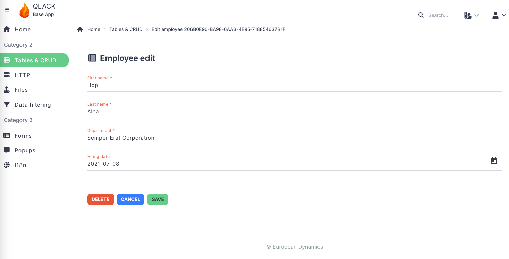
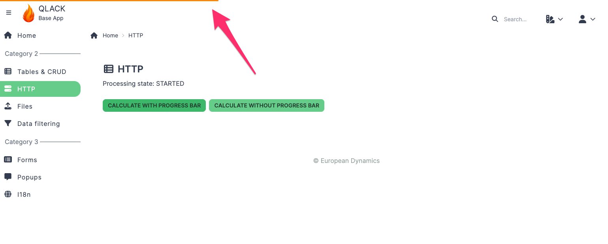
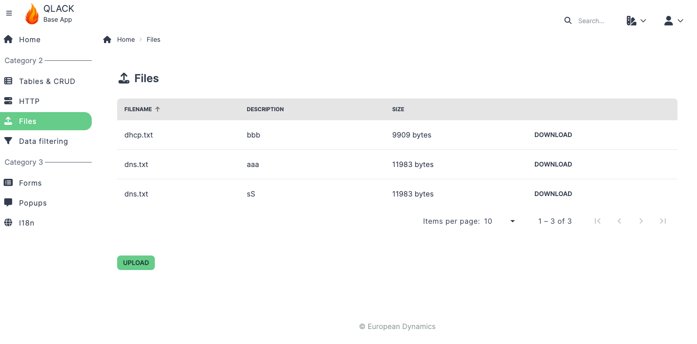
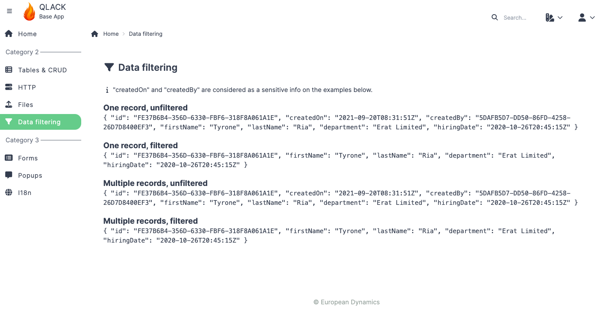
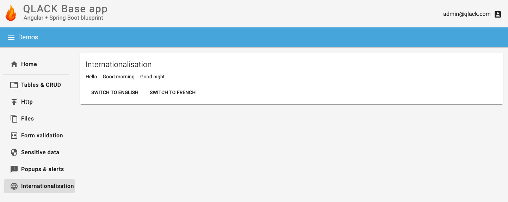

# QLACK-Base-Application

The QLACK Base Application is a full-stack blueprint, featuring Angular and Spring Boot. You can
start your new project by cloning this repo and then built on top of the blueprint.

## Features

### Login/Logout with JWT integration

### Tables with sorting, pagination, and filtering

### CRUD

### HTTP progress bars

### File upload/download

### Form back-end validation

### Annotation-based content filtering

### Standardised popups

### Internationalisation

## Development setup

To start the back-end component, issue:

`mvn spring-boot:run`

To start the front-end component, issue:

`ng serve --host 0.0.0.0 --disable-host-check --proxy-config proxy.conf.json`

## Containers support

Both the front-end and the back-end component come with a `Dockerfile` allowing you to build Docker
images.

The supplied build scripts provide two interesting features:

* The application is built within a Docker container, so no local Java or Angular/NodeJS environment
  is necessary. This allows anyone to clone your project and build Docker containers for it without
  any additional setup.

* Image building follows a multi-stage approach. Expensive operations (such as downloading Maven
  artifacts or NodeJS packages) takes place in a previous phase of your build, allowing you to skip
  those phases in future builds (provided your dependencies remain the same).
  
A top-level Docker Compose file is also provided, allowing you to build and run the complete application
stack in just a single command:

`docker compose up --build`

The application becomes accessible on port 6565, i.e. http://localhost:6565. 
