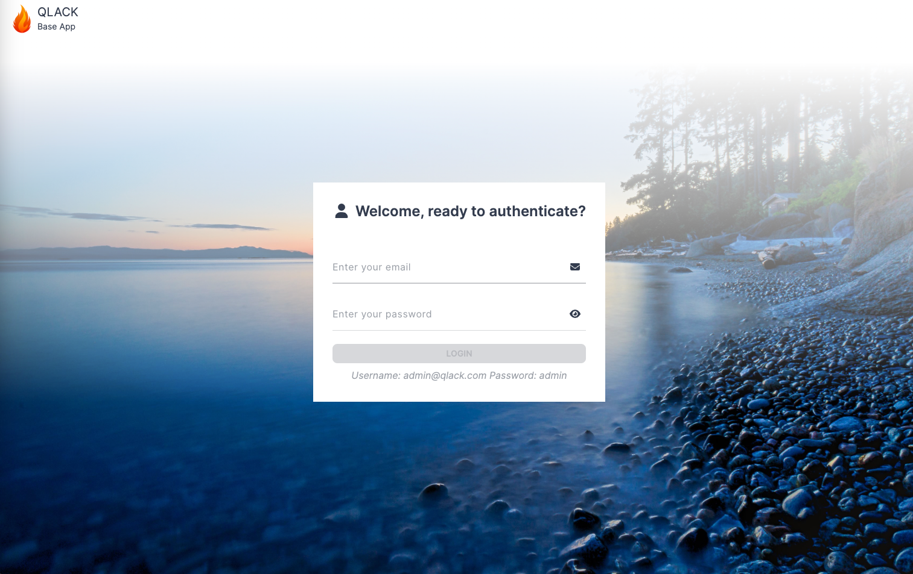
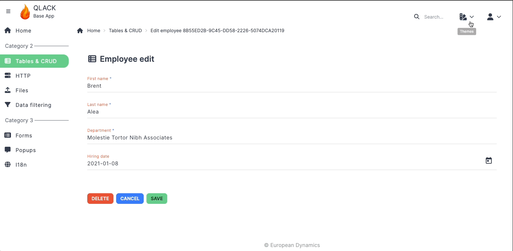
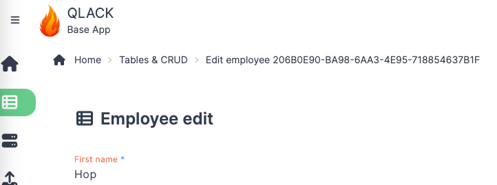
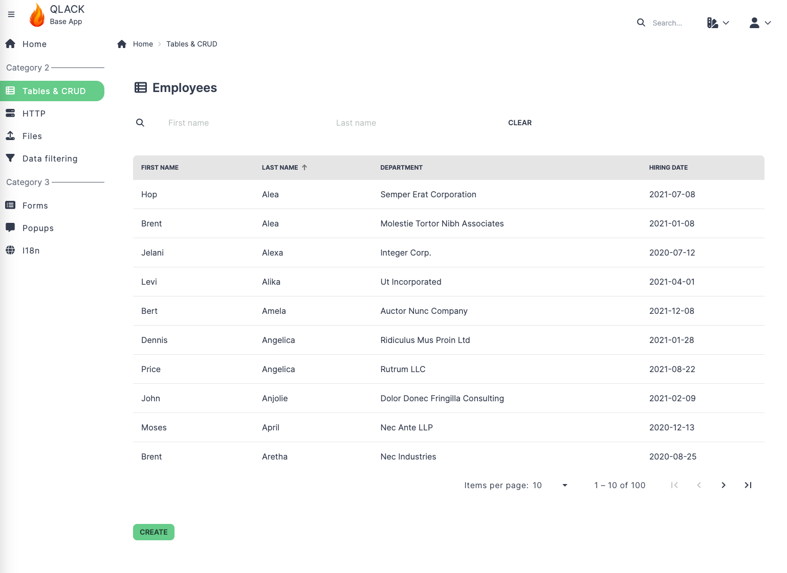
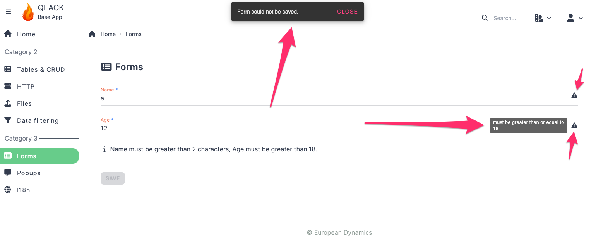
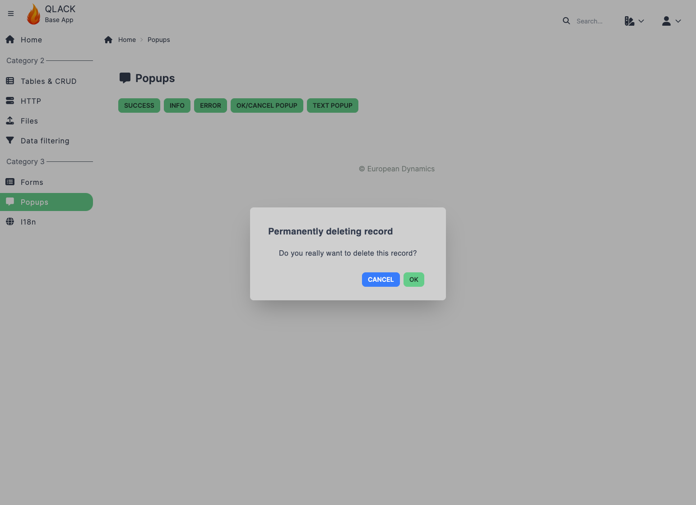
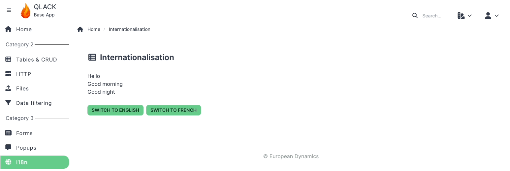

# QLACK-Base-Application

The QLACK Base Application is a full-stack blueprint, featuring Angular and Spring Boot. You can
start your new project by cloning this repo and then built on top of it.

[](https://gitpod.io/#https://github.com/qlack/QLACK-Base-Application)

## Features

### Login / Logout with JWT integration



### Theme support



### Dynamic collapsible sibebar, dynamic breadcrumb




### Tables with sorting, pagination, and filtering with minimal code



### CRUD examples


### HTTP progress bars


### File upload / download


### Form back-end validation



### Annotation-based content filtering


### Standardised popups



### Internationalisation



## Development setup

To start the back-end component, issue:

`mvn spring-boot:run`

To start the front-end component, issue:

`npm start`

## Containers support

Both the front-end and the back-end component come with a `Dockerfile` allowing you to build Docker
images.

The supplied build scripts provide two interesting features:

* The application is built within a Docker container, so no local Java or Angular/NodeJS environment
  is necessary. This allows anyone to clone your project and build Docker containers for it without
  any additional setup.

* Image building follows a multi-stage approach. Expensive operations (such as downloading Maven
  artifacts or NodeJS packages) takes place in a previous phase of your build, allowing you to skip
  those phases in future builds (provided your dependencies remain the same).

A top-level Docker Compose file is also provided, allowing you to build and run the complete application
stack in just a single command:

`docker compose up --build`

The application becomes accessible on port 6565, i.e. http://localhost:6565.

## Extra Security Feature CustomCookieFilter

The `CustomCookieFilter` is a filter designed to create a token and place it in a cookie, subsequently validating this
token with every request. Specifically, it involves JWT authentication. During the initial login process, a token is
generated and placed in a cookie. Each cookie has a timer associated with it, expiring either when the JWT expires or
becomes invalid after its first use for a single request. Upon each request, the previously generated token is
validated, and a new one is created, replacing the old token in a cookie. An exception to this process occurs during
logout, where this filter is skipped.

In the case of multiple requests, old cookies are kept alive for a short time, with a default of 60 seconds. This is
implemented to prevent conflicts when the server experiences a delay and is unable to send back a new cookie for the
next request. This duration is configurable through the `cookie-timer` property in the application file.

Furthermore, cookies are stored in a cache, and a scheduler is in place to clean this cache. The cleaning schedule can
be modified using the `cookie-cache-clean-timer` property, which uses a cron-like expression (`0 * * ? * *` in the
provided example).

To implement this functionality, the following line of code should be added to your `WebSecurity` class within the
`SecurityFilterChain`:

```java
.addFilterBefore(customCookieFilter, BasicAuthenticationFilter .class)
```

Additionally, the following properties should be added to your application file:

```yaml
customCookieFilter:
  cookie-name: COOKIE-TOKEN # the name of the cookie
  cookie-timer: 60 # per seconds, the timer for keeping old cookies alive for multiple requests
  cookie-cache-clean-timer: 0 * * ? * * # the scheduler where we clean cache from non-valid cookies
  login-path: '/**/users/auth'
  logout-path: '/**/users/logout'
```

Ensure these configurations are in place for the filter to function correctly.

## Angular unit tests

There are 25 Angular unit tests as examples to demonstrate testing for Components and Services. The unit tests are the
files with naming ending with .spec.ts. You can find the tests at folders "login", "logout", "employee".

The unit tests are using Jasmine and Karma. All the configurations to use Jasmine and Karma are located inside the
`karma.conf.js` file. Open a terminal in `qlack-base-application-ui` folder and run the unit tests by typing the 
command `npm run test`.

### Karma unit tests report

The report of unit tests will be as shown in the screenshot.


### Karma code coverage report

In the same terminal you can run the command "npm run karma_coverage" to get the code coverage.
The report of code coverage will be as shown in the screenshot.

The karma code coverage module will also create a code coverage report which you will find it in the path "
coverage/qlack_base_application_ui".
The html report of the code coverage will be as shown in the screenshot.


## Springboot Backend

There are 16 unit tests for the Backend. **Jacoco** plugin for code coverage is also included in the pom.xml.